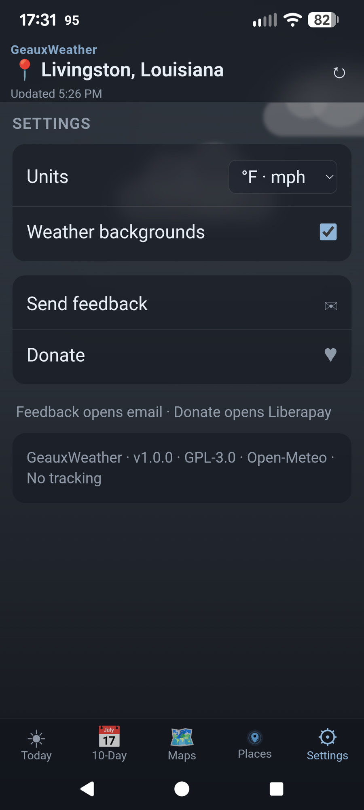
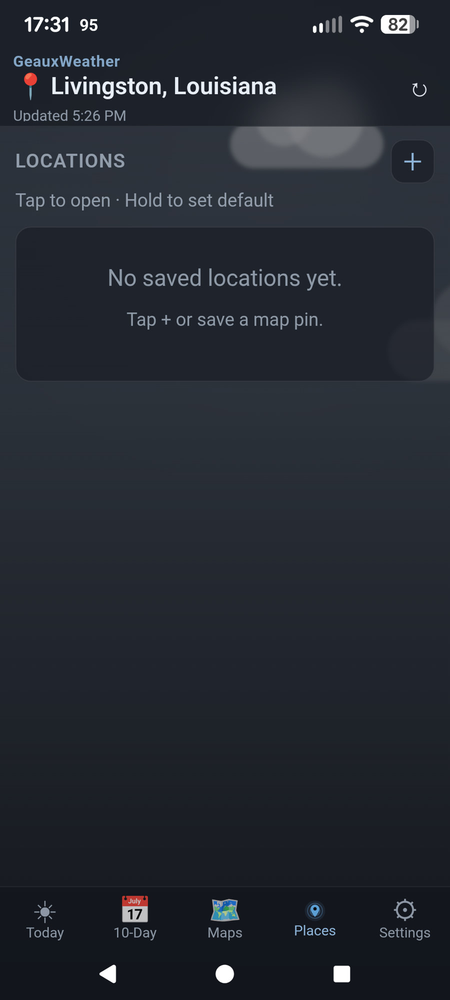
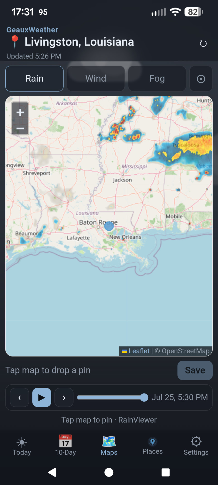
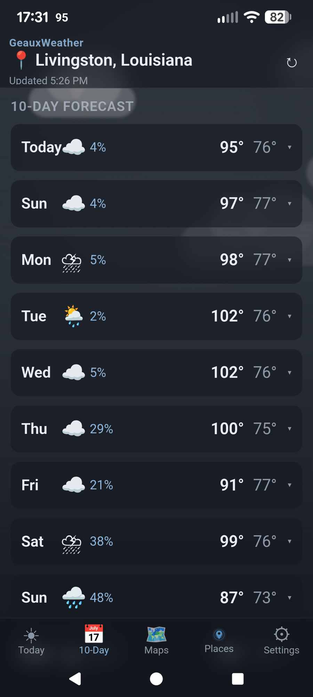
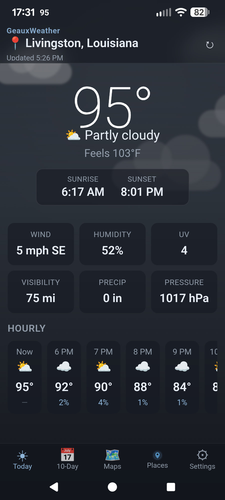

# GeauxWeather

Clean, fast, no-ads weather for Android.

- **Package**: `com.geauxweather.app`  
- **Stack**: Capacitor 7 + plain HTML/CSS/JS  
- **Data**: Open-Meteo + RainViewer + OSM Nominatim  
- **License**: GPL-3.0-or-later  

## Screenshots

| Today | 10-Day | Maps |
|:---:|:---:|:---:|
|  |  |  |

| Places | Settings |
|:---:|:---:|
|  |  |

## Build

```bash
npm ci
npm run apk
adb install -r android/app/build/outputs/apk/debug/app-debug.apk
```

## Features

- Today, hourly, 10-day forecast  
- Maps: Rain, Wind, Fog, Hurricane (NHC cone + track), Tornado (NWS watches/warnings)  
- Severe storm alerts (Settings): tornado, severe thunderstorm, nearby tropical for home/default location  


- Places, GPS + default location  


- Weather backgrounds (day/night) with Settings toggle  
- Home widget + status-bar temperature  
- Feedback + Liberapay donate  

